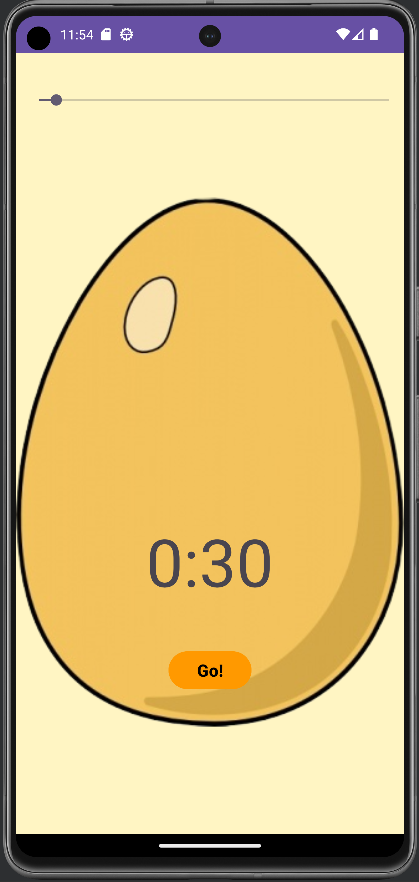

# Android Timer App 🕒

The Android Timer App is a simple timer application that allows you to set a countdown timer and play a sound when the timer reaches zero. It's a practical tool for various timing needs, whether it's cooking, workouts, or just keeping track of time.

## How to Use 📚

1. Adjust the timer duration using the seek bar.
2. Press the "Go!" button to start the countdown timer.
3. The timer will display the remaining time in minutes and seconds.
4. When the timer reaches zero, it will play a sound to alert you.
5. Press the "Stop" button to reset the timer.

## Screenshot 📷

## Technologies Used 💻

- Android Studio
- Java
- MediaPlayer for audio

## Code Overview 🧩

The core functionality of this app includes:

- Setting a timer using a SeekBar to adjust the duration.
- Displaying the remaining time in minutes and seconds.
- Playing a sound when the timer reaches zero using MediaPlayer.
- Starting, stopping, and resetting the timer.

## Author 👩‍💻👨‍💻

- [Saad](https://github.com/bluekitsune-sad)

## Get in Touch:

- 📧 [Email me](mailto:saadshaan619@gmail.com)

## Additional Notes 📝

This code also includes commented-out code blocks that demonstrate alternative ways to create timers using CountDownTimer and a Handler for educational purposes.

## License 📜

This project is open-source and available under the MIT License. You are welcome to use, modify, and distribute the code as needed.

Feel free to fork, clone, or contribute to this project to enhance its features.

## Getting Started 🚀

To get started with the Android Timer App, follow these steps:

1. Clone the repository to your local machine.

2. Open the project in Android Studio.

3. Build and run the app on your Android device or emulator.

4. Enjoy using the Timer App and explore the code to learn more about how it works.

Have fun with your new timer app! 🚀
