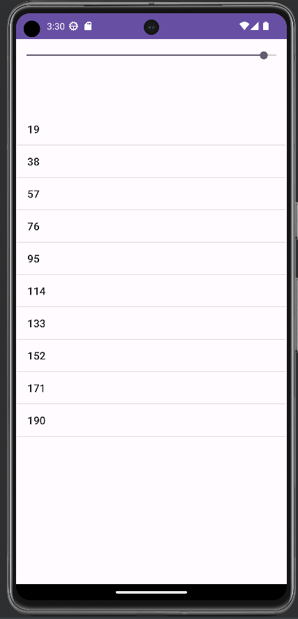

# Times Table Generator 🕰️

The Times Table Generator app helps you quickly generate and view multiplication tables for any number between 1 and 20. It's a useful tool for learning and practicing multiplication.

## How to Use 📚

1. Slide the seek bar to select a number for which you want to generate the times table.
2. The app will display the times table for the selected number from 1 to 10.
3. You can change the selected number by moving the seek bar.
4. The app updates the times table instantly as you change the number.

## Screenshot 📷

## Technologies Used 💻

- Android Studio
- Java

## Code Overview 🧩

The core functionality of this app lies in generating and displaying times tables. This is achieved by:
- Utilizing a SeekBar for number selection.
- Dynamically generating the times table for the selected number.
- Displaying the times table using a ListView with ArrayAdapter.

## Author 👩‍💻👨‍💻

- 

## Acknowledgments 🙌

Special thanks to [OpenAI](https://www.openai.com/) for the AI-powered assistant that helped create this README. ✨

Enjoy practicing your times tables with the app!
