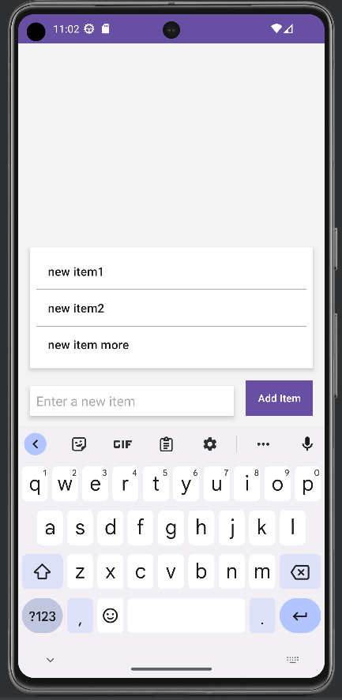

# Android To-Do List App

📝 Welcome to the Android To-Do List App! 📝

[](https://opensource.org/licenses/MIT)
[](https://github.com/bluekitsune-sad/smallerProjects/stargazers)
[](https://github.com/bluekitsune-sad/smallerProjects/network)
[](https://github.com/bluekitsune-sad/smallerProjects/issues)
[](https://github.com/bluekitsune-sad/smallerProjects/pulls)


## 📌 Overview

The Android To-Do List App is a simple task management app designed for Android devices. It allows users to create, save, and read their to-do items from a local text file on their device.

## 📷 Screenshots

Here are some screenshots of the Android To-Do List App in action:

📱 Mobile:


## 📋 Features

- [x] Create and add new tasks to your to-do list.
- [x] Save tasks to a local text file on your device.
- [x] View your to-do list.
- [x] Mark tasks as completed.
- [x] Remove completed tasks from your list.

## 🛠️ Installation

You can install the Android To-Do List App on your Android device by following these steps:

1. Clone this repository:

   ```sh
   git clone https://github.com/bluekitsune-sad/smallerProjects.git

    Open the project in Android Studio.

    Build and run the app on your Android device.

💡 Usage

Once the app is installed on your Android device, you can:

    Open the app to create new tasks.
    Save tasks to your local device.
    View your to-do list.
    Mark tasks as completed.
    Remove completed tasks from your list.

🤝 Contributing

You're welcome to contribute to this project. Here's how:

✨ Contributions are welcome! ✨

    Fork the repository.
    Create your feature branch: git checkout -b feature-name
    Commit your changes: git commit -m 'Add some feature'
    Push to the branch: git push origin feature-name
    Submit a pull request.

Please read the Contributing Guide for more details.
📝 License

This project is licensed under the MIT License. Check out the LICENSE file for more details.
📞 Contact

Feel free to reach out if you have questions, suggestions, or just want to chat:

- 📧 Email: [get in touch](mailto:saadshaan619@gmail.com)

Let's connect and make something amazing together! ✨
