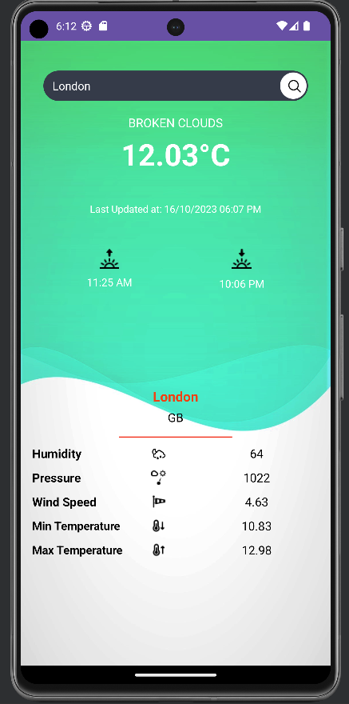

# 🌦️ WeatherApp with OkHttp

This Android application uses the OkHttp library to retrieve weather information for a specified city. The weather data includes details like temperature, humidity, forecast, and more.

## 🚀 Getting Started

1. Clone this repository to your local machine.
2. Open the project in Android Studio.
3. Run the application on an Android emulator or device.

## 📱 Usage

1. Enter the city name in the provided input field.
2. Click the "Search" button.
3. Weather information for the specified city will be displayed.

## ✨ Features

- Retrieve real-time weather data for a given city.
- Display the city name, country, time of the last update, temperature, forecast, humidity, minimum and maximum temperature, sunrise and sunset times, pressure, and wind speed.

## 📚 Libraries Used

- [OkHttp](https://square.github.io/okhttp/): Used for making HTTP requests.

## 📷 Example

## 📄 License

This project is licensed under the MIT License - see the [LICENSE](LICENSE) file for details.

## 📞 Contact

If you have any questions or suggestions, feel free to contact the project maintainer:

- 📧 Email: [your@email.com](mailto:saadshaan619@gmail.com)

Let's connect and make something amazing together! ✨
